# 🎯 Adobe Round 1B: Universal Document Intelligence Engine

## 🚀 Quick Start

### 🐳 Option 1: Docker Deployment (Recommended)

#### Using Docker Compose
```bash
# 1. Clone repository
git clone https://github.com/JayrajSinh16/adobe-round-1b.git
cd adobe-round-1b

# 2. Place PDF documents
mkdir -p input/documents
cp your-documents.pdf input/documents/

# 3. Configure persona and job (optional - defaults provided)
echo "Data Scientist" > input/persona.txt
echo "Extract insights from research papers for machine learning applications" > input/job.txt

# 4. Run with Docker Compose (downloads models automatically)
docker-compose up

# 5. Check results
cat output/result.json
```

#### Using Docker directly
```bash
# Build image (downloads all models during build)
docker build -t adobe-round-1b:latest .

# Run container
docker run --rm \
  -v $(pwd)/input:/app/input \
  -v $(pwd)/output:/app/output \
  -v adobe-cache:/app/cache \
  -v adobe-models:/app/models \
  adobe-round-1b:latest
```

### 🔧 Option 2: Manual Installation

#### System Dependencies
```bash
# Ubuntu/Debian
sudo apt-get update
sudo apt-get install tesseract-ocr tesseract-ocr-eng python3-dev

# macOS  
brew install tesseract

# Windows (using chocolatey)
choco install tesseract
```

#### Python Setup
```bash
# 1. Create virtual environment
python -m venv venv
source venv/bin/activate  # Windows: venv\Scripts\activate

# 2. Install dependencies
pip install -r requirements.txt

# 3. Download models (one-time setup)
python scripts/prepare_models.py

# 4. Run the system
python run.py
```


## 🏗️ Engine Architecture & Workflow

```mermaid
graph TD
    A[📄 PDF Documents] --> B[🔍 Enhanced Outline Extraction]
    C[👤 Persona Input] --> D[🧠 Persona Analysis]
    E[🎯 Job Description] --> D
    
    B --> F[📝 Content Extraction]
    D --> G[🔍 Query Profile Building]
    
    F --> H[🎯 Ranking Engine]
    G --> H
    
    H --> I[📊 Multi-Scorer Ensemble]
    I --> J[🔧 Constraint Filtering]
    J --> K[✨ Subsection Refinement]
    K --> L[📋 Final Results]
    
    style B fill:#e1f5fe
    style H fill:#f3e5f5
    style I fill:#fff3e0
    style L fill:#e8f5e8
```




### 🔧 Core Components

#### 1. **Enhanced Outline Extraction Engine**
- **Enhanced Font Strategy**: Advanced typography analysis with multi-factor scoring
  - Font size analysis (40% weight): Hierarchical size detection
  - Font formatting (25% weight): Bold, italic, and style analysis  
  - Content quality (20% weight): OCR error detection and noise filtering
  - Spatial relationships (10% weight): Block isolation and spacing analysis
  - Structural patterns (5% weight): Numbered sections and keywords
- **Universal Noise Filtering**: Eliminates UI elements, OCR errors, navigation text
- **Domain-Agnostic Patterns**: No hardcoded business rules or domain-specific logic

#### 2. **Universal Content Extraction**
- **Boundary Detection**: Intelligent section boundary identification
- **Text Cleaning**: OCR artifact removal and content normalization
- **Multi-format Support**: Handles scanned documents, digital PDFs, mixed layouts

#### 3. **Universal Persona Analysis**
- **Domain Identification**: Automatic detection of user expertise area
- **Intent Classification**: Learning vs. implementation vs. decision-making
- **Keyword Extraction**: Context-aware term identification
- **Profile Building**: Dynamic query construction without domain constraints

#### 5. **Intelligent Filtering Pipeline**
- **Semantic Filter**: Intent-based content relevance  
- **Section Filter**: Anti-pattern elimination
- **Quality Filter**: Content usefulness scoring

#### 6. **Advanced Content Synthesis**
- **Universal Context Extraction**: Domain-agnostic thematic grouping
- **Maximal Marginal Relevance**: Diversity vs. relevance optimization
- **Dynamic Summary Length**: Adaptive content synthesis
- **Quality-Based Selection**: Intelligent sentence filtering


### 📁 Input Configuration

#### Document Setup
```bash
# Place PDF documents in input directory
input/
├── documents/
│   ├── research-paper-1.pdf
│   ├── technical-manual.pdf  
│   └── business-report.pdf
├── persona.txt
└── job.txt
```


### 🔍 Enhanced Outline Extraction

Our **Enhanced Font Strategy** provides superior heading detection:

```python
Scoring Algorithm:
├── Font Size Analysis (40%)     # Relative size hierarchy
├── Font Formatting (25%)       # Bold, italic, styling  
├── Content Quality (20%)       # OCR error detection
├── Spatial Relationships (10%) # Block spacing and isolation
└── Structural Patterns (5%)    # Numbered sections, keywords
```


```

## 🐳 Docker Configuration

### Pre-Downloaded Models

The Docker image includes:
- **Sentence Transformers**: `all-MiniLM-L6-v2` (134MB)
- **spaCy Model**: `en_core_web_sm` (15MB)  
- **NLTK Data**: punkt, POS tagger, wordnet (10MB)
- **Tesseract OCR**: English + Japanese language support

### Environment Variables
```bash
PYTHONPATH=/app
TRANSFORMERS_CACHE=/app/cache/transformers
SENTENCE_TRANSFORMERS_HOME=/app/cache/sentence_transformers  
HF_HOME=/app/cache/huggingface
TORCH_HOME=/app/cache/torch
NLTK_DATA=/app/cache/nltk_data
DEBUG=false
```


## 🧪 Testing & Validation

### Quick Test
```bash
# Test Docker setup
chmod +x scripts/test_docker.sh
./scripts/test_docker.sh

# Manual testing
python run.py --verbose
```


### Project Structure
```
adobe-round-1b/
├── src/
│   ├── outline_extraction/
│   │   ├── strategies/
│   │   │   └── enhanced_font_strategy.py  # 🔥 Core innovation
│   │   ├── detectors/
│   │   └── builders/
│   ├── content_extraction/
│   ├── persona_analysis/
│   ├── ranking_engine/
│   │   ├── scorers/               # Multi-scorer ensemble
│   │   └── filters/               # Universal filtering
│   └── subsection_extraction/
│       └── refiners/
│           └── content_synthesizer.py     # 🔥 Universal synthesis
├── config/                        # Universal settings
├── input/                        # Documents and profiles  
├── output/                       # Results
├── cache/                        # Model cache
├── models/                       # Local models
├── scripts/                      # Utilities
└── docker-compose.yml           # 🐳 Production deployment
```


## 📄 License & Support

**Developed for Adobe India Hackathon 2025**

### Support Channels
- **GitHub Issues**: [Report issues](https://github.com/JayrajSinh16/adobe-round-1b/issues)
- **Email**: ironm1024@gmail.com  
- **Documentation**: Complete setup guide in `DOCKER_SETUP.md`
